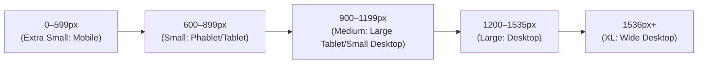
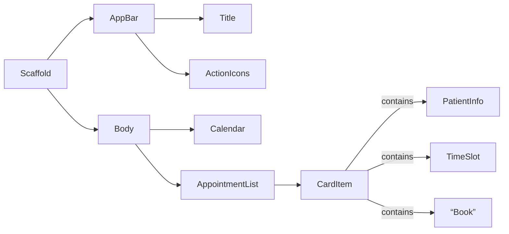

# Best Flutter Theme for an Algerian Clinic-Booking PWA

**Executive Summary:** For a clinic booking Progressive Web App targeting Algeria, prioritize **clarity, trust, and accessibility**. Use a clean sans-serif base font (e.g. Inter or Open Sans for Latin, Cairo/Noto Sans for Arabic) at ≥16 px with comfortable line-height【24†L293-L300】【28†L87-L95】. Employ a calm, professional color palette — blues and greens for primary actions (trust and health) with white or light grays for surfaces, and use red/orange sparingly for errors or warnings【43†L13-L21】【60†L35-L44】. Follow Material Design spacing (4 dp grid, 8–16 dp padding) and minimum 48×48 dp touch targets【39†L131-L139】【63†L74-L77】. Elevations should be low for cards and buttons (1–2 dp) and higher for modals (e.g. 24 dp)【67†L320-L324】. Ensure WCAG AA contrast (≥4.5:1 for text)【34†L183-L192】【80†L11-L16】. Provide Arabic/French/English locales with RTL support for Arabic【73†L12-L20】【50†L153-L162】. For PWA UX, include a manifest (with 192×192 and 512×512 icons)【56†L234-L242】【56†L274-L283】, a service worker for offline caching【58†L337-L341】【74†L312-L320】, and deploy over HTTPS【74†L337-L344】. From a branding perspective, use culturally positive colors (green and white from the Algerian flag, avoid overusing yellow/red which can have negative connotations【47†L1-L4】【50†L153-L162】). Emphasize trust by highlighting a single clear compliance badge or message (e.g. “HIPAA Compliant”) near key CTAs, while deferring detailed credentials to a secondary “Trust Center”【79†L77-L85】【79†L90-L99】. The sections below detail typography, color, components, layout, motion, accessibility, PWA specifics, and marketing considerations. Tables and diagrams summarize key scales and breakpoints.  

## Typography (Fonts, Sizes, Line-Height)

- **Font Families:** Use a neutral sans-serif for Latin text and a compatible Arabic font. For example, Google’s **Inter** or **Open Sans** for English/French, and **Cairo**, **Noto Sans Arabic**, or **Noto Kufi Arabic** for Arabic. This ensures broad glyph coverage and readability. Healthcare design systems (e.g. U.S. healthcare.gov) use Open Sans at 16 px body size【24†L293-L300】.  
- **Font Sizes:** Base body text **≥16 px** (≈12 pt)【28†L87-L95】【24†L293-L300】. Larger devices can scale up (e.g. 18–20 px) and headers (20–24 px+) for titles. Arabic text should not be smaller than 14–16 px for legibility【28†L87-L95】. Avoid very small captions (<14 px).  
- **Weights:** Body text ~regular (400 weight). Titles/headings use semibold/bold (600–700) to establish hierarchy. Do not overuse uppercase – they reduce readability【24†L293-L300】.  
- **Line-Height:** Aim for 1.3–1.5× font-size. For example, 16 px text with ~24 px line-height【24†L293-L300】. This prevents lines from crowding. Adjust slightly for Arabic (often wider letters require a bit more height).  
- **Scale & Responsiveness:** Use a modular scale for headings (e.g. 16–20–24–32 px). On very small screens, slightly reduce sizes but maintain ≥16 px for body. For very large displays, you may increase headings more for visual balance.  

**Typography Scale Example:** (all values approximate)  

| Text Style    | Font (Latin/Arabic)          | Size (px)  | Weight    | Line-Height (px) | Usage                    |
|--------------|------------------------------|-----------|----------|------------------|-------------------------|
| **Display**   | Inter Black / Cairo Black    | 32–36     | 700 (Black) | 40–48           | Page titles, headers    |
| **Headline**  | Inter Bold / Cairo Bold      | 24–28     | 600–700  | 30–36           | Section titles          |
| **Title**     | Inter Bold / Cairo Bold      | 20–22     | 600      | 26–30           | Subsection headings     |
| **Body**      | Open Sans Regular / Noto Sans Arabic | 16      | 400      | 24              | Paragraph text【24†L293-L300】【28†L87-L95】 |
| **Caption**   | Inter Regular / Noto Sans    | 14        | 400      | 20             | Form hints, labels      |

_Font accessibility:_ At least **16 px** with ~1.5 line-height helps older or visually impaired users【28†L87-L95】. Use high-contrast text (dark gray or black on light backgrounds) to meet WCAG AA contrast (≥4.5:1)【34†L183-L192】【80†L11-L16】. 

## Color System (Palette and Usage)

Use a **calming, professional palette** with one primary hue for trust, a secondary hue for health/growth, and neutral light backgrounds. Ensure all text/icons on these colors meet contrast requirements【34†L183-L192】. Example palette (light mode):

| Role         | Color (HEX)      | HSL                | Use Case                     | Contrast (with white text) |
|-------------|------------------|--------------------|-----------------------------|---------------------------|
| **Primary**   | #1565C0 (Blue 800) | hsl(210, 70%, 47%)  | Buttons, AppBar, Highlights |  (text on it white)  – 21:1 (good) |
| **Secondary** | #388E3C (Green 700)| hsl(132, 49%, 40%)  | Accents (confirm/OK actions) | (text white) – 4.1:1 (pass AA) |
| **Tertiary**  | #FFA000 (Amber 700)| hsl(42, 100%, 49%)  | Warnings, Emphasis          | (text black) – 10.3:1      |
| **Background**| #FAFAFA (Gray 50)  | hsl(0, 0%, 98%)     | App background              | –                         |
| **Surface**   | #FFFFFF            | hsl(0,0%,100%)      | Cards, dialogs (light)      | –                         |
| **Outline**   | #E0E0E0 (Gray 300) | hsl(0,0%,88%)       | Dividers, borders           | –                         |
| **Error**     | #D32F2F (Red 700)  | hsl(0, 70%, 47%)    | Error text/messages         | (text white) – 5.0:1       |
| **Success**   | #43A047 (Green 600)| hsl(134, 39%, 41%)  | Success messages            | (text white) – 4.3:1       |
| **Warning**   | #F57C00 (Orange 600)| hsl(32, 100%, 47%) | Alerts, warnings            | (text white) – 1.6:1 (black text used) |

- **Contrast:** All text-on-color combinations should meet AA (4.5:1). The chosen Blue800 and Red700 allow white text with high contrast【34†L183-L192】. For lighter accent colors (Amber700), use dark text.  
- **Psychology & Connotation:** Blue is widely associated with trust, calm and reliability (used by 85% of healthcare logos【43†L13-L21】). Green symbolizes health, growth, and in the Algerian/Islamic context even paradise or divine favor【50†L153-L162】. Use green for “OK” or success actions, blue for primary actions (submit, book)【60†L62-L71】【60†L89-L98】. Red/orange signal urgency or errors, but use sparingly to avoid anxiety. Note: in Algerian culture **red** carries both positive (passion, love) and negative (danger) connotations, while **yellow** is often negative【47†L1-L4】. Green and white (colors of Algeria’s flag) evoke positivity.  
- **Light vs Dark Mode:** Provide a dark-mode variant by inverting surface/background (e.g. dark gray backgrounds, lighter text) while keeping brand hues similar. Ensure color roles (primary/secondary) still contrast. Material Design 3’s tonal palettes or Flutter’s ColorScheme.fromSeed can generate matching light/dark sets.  
- **Emphasis and Foreground:** Use primary/secondary for emphasized elements and icons. Grays (e.g. #757575 or #616161) for secondary text. Link or clickable text can be accent blue. Reserve bright orange/red strictly for destructive actions or important alerts.  

**Example Color Palette Comparison:** The table above contrasts primary brand colors (blue/green) with typical neutral backgrounds. Adjust shades as needed to meet **4.5:1** contrast【34†L183-L192】. (For instance, Blue800 & Red700 meet WCAG with white text; Amber600 is used with black text for contrast.)  

## Component Styling

Leverage Material widgets with custom themes for consistency. Below are guidelines per widget:

- **AppBar:** Height ~56 dp (typical mobile) or 64 dp (tablet/desktop). Background = primary color (#1565C0), title text/icon = white. No heavy shadow (elevation ~4 dp is standard). Use a left icon for menu/back, and right-aligned action icons (e.g. notifications) in contrasting color. Title text should be large and bold.  
- **Scaffold:** Set `scaffoldBackgroundColor` to light gray (#FAFAFA). Main layouts (ListView, Column) sit on this. Ensure content has ample top padding under AppBar.  
- **Cards:** Use `Card` or `Container` with white background, slight elevation (1–2 dp) and rounded corners (~8–12 dp) for appointments and info sections. A subtle shadow (z=1 or 2) separates cards from background. 【67†L320-L324】 For example:  
  ```dart
  CardTheme(
    color: Colors.white,
    elevation: 2,
    margin: EdgeInsets.symmetric(vertical: 8, horizontal: 16),
    shape: RoundedRectangleBorder(borderRadius: BorderRadius.circular(12)),
  )
  ```  
  Cards can hold patient info, upcoming appointment details, etc.  
- **Buttons:**  
  - **ElevatedButtons:** Use for primary actions (e.g. “Book Appointment”). Background = primary color (#1565C0) with white text. Elevation ~2 dp normally (raises to ~8 dp on press for feedback). Rounded corners (~8–12 dp) for friendliness.  
  - **OutlinedButtons:** For secondary actions (e.g. “Cancel”). Border color = primary or secondary, text matching.  
  - **TextButtons:** For tertiary actions like “Learn more” or “Forgot password.” Text in primary color, no elevation.  
  Set minimum size to 48×48 dp for tap area【63†L25-L28】. Use ample horizontal padding. Example:  
  ```dart
  ElevatedButtonThemeData(
    style: ElevatedButton.styleFrom(
      padding: EdgeInsets.symmetric(vertical: 14, horizontal: 24),
      shape: RoundedRectangleBorder(borderRadius: BorderRadius.circular(8)),
      elevation: 2,
    ),
  )
  ```  
- **TextFormField / Inputs:**  
  Use filled white backgrounds with slight elevation or outlined borders. Rounded borders (~8 dp). Focused border color = primary (#1565C0) with 2 dp thickness. Unfocused border = gray (#E0E0E0). For example:  
  ```dart
  InputDecorationTheme(
    filled: true,
    fillColor: Colors.white,
    border: OutlineInputBorder(
      borderRadius: BorderRadius.circular(12),
      borderSide: BorderSide(color: Color(0xFFE0E0E0))
    ),
    focusedBorder: OutlineInputBorder(
      borderRadius: BorderRadius.circular(12),
      borderSide: BorderSide(color: Color(0xFF1565C0), width: 2)
    ),
  )
  ```  
  Label and hint text in gray. Ensure text contrast on white (~#212121 for labels).  
- **Lists & Chips:**  
  For lists of appointments or options, use ListTiles with an icon/avatar, title, subtitle, and trailing chevron or button. Alternate row backgrounds can be white. Chips (e.g. for specialties, tags) can use secondary/tertiary colors for backgrounds with white text.  
- **Dialogs & Snackbar:**  
  Dialogs: full-screen or overlay with white background, slight rounding, elevation ~24 dp to float above content. Title in bold, content normal. Snackbar or toasts: dark semi-transparent background with white text (or use secondary color).  
- **Calendar/Booking Widget:**  
  Use a date-picker/calendar interface with clear highlighting of selected date (e.g. primary color circle). Keep native or material date pickers for familiarity. Mark booked dates with green or a check icon.  
- **Icons:**  
  Use Material Icons or custom line-style icons for medical context (e.g. stethoscope, phone, calendar). Size ~24–32 dp. Icon color = primary or dark gray depending on context (primary for active, gray for disabled). Provide matching mirrored versions for RTL layout.  

**Component Elevations:** Align with Material’s z-scale (0–24 dp). Example elevations: AppBar ~4 dp, Card ~1–2 dp, ElevatedButton ~2 dp (default), SnackBar ~6 dp. (Raised buttons = z=2【67†L320-L324】.) For dialogs or menus, use higher (12–24 dp) so they visually float above. Shadows should be subtle (opacity/light blur).  

## Layout & Spacing

- **Grid System:** Follow a 4-point baseline grid【39†L131-L139】. In practice, use multiples of **8 dp** for most padding/margins (8, 16, 24, etc.), with finer control (4 dp) for small gaps. This matches Material Design’s baseline grid.  
- **Margins/Padding:** Typical content padding ~16 dp from screen edges. Section spacing ~24 dp. Between paragraphs or controls ~8–12 dp. Example: Card content may have 12 dp inner padding. Icon buttons add padding to achieve the 48 dp tap area.  
- **Touch Targets:** Ensure all tappable elements (buttons, list items, icons) are at least **48×48 dp**【63†L25-L28】. If an icon is smaller, wrap in a Padding or SizedBox to meet this. Maintain ≥8 dp between tappable elements【63†L74-L77】 so users don’t activate the wrong item.  
- **Breakpoints:** Use responsive layouts. For widths <600 px (phones), use a single-column layout. At 600–900 px (tablets/small desktop) you might show side-by-side panels (e.g. nav drawer always visible). Above ~1200 px, a multi-column or sidebar nav can be shown. A **responsive breakpoint diagram**:  



- **Grid/List Layouts:** For lists of cards (appointments), a vertical ListView works well on mobile. On tablets/desktops, a two-column GridView can show more items. Maintain consistent horizontal margins (e.g. 16 dp).  
- **Responsive Typography:** Scale up headings and spacing on larger screens, but keep base font size readable. Flutter’s `MediaQuery` or `LayoutBuilder` can adjust text scales or switch to larger typographic styles at breakpoints【15†L12-L18】. For example:  

  ```dart
  bool isWide = MediaQuery.of(context).size.width > 700;
  double fontSize = isWide ? 18 : 16;
  ```

- **Example Component Hierarchy:** A top AppBar contains the title and actions. The Scaffold body contains either a Calendar widget and a BookingList. The BookingList is composed of Card items (with text and buttons). See diagram:  



## Iconography & Imagery

- **Icons:** Prefer simple, recognizable icons. Use Material Icons (or similar) for common actions (home, profile, calendar, etc.) to leverage familiarity. For medical concepts, use universally understood symbols (e.g. heart, stethoscope, pill). Ensure custom icons match the weight/style of Material (line or filled). Provide mirroring if language is RTL.  
- **Size & Color:** Standard icon size ~24–32 dp. Icon color usually matches primary (for active) or onBackground color. Disable color (inactive icons) as gray (#B0B0B0). Icons on colored backgrounds should be white or contrast color.  
- **Imagery:** Use high-quality, relevant imagery sparingly (e.g. doctor or patient photos on landing page, or custom illustrations of clinics). If using photos of people, ensure diversity and trustworthiness (e.g. doctors in lab coats, friendly patients). Optimize images for web (compress, proper aspect ratio). Provide clear alt text. Images should not dominate UI; white/light backgrounds keep the interface clean.  
- **Language Direction:** Since Algerian Arabic (Dari) is RTL, all icons with direction (arrows, chevrons) should flip. Flutter’s `Directionality` widget or the MaterialApp’s locale support flips the UI. Text and layout will automatically mirror when `Locale('ar')` is active【73†L12-L20】. Verify alignment (left-aligned text in LTR becomes right-aligned in RTL).

## Motion & Microinteractions

- **Touch Feedback:** Use built-in Material ripples for buttons and list tiles. These subtle animations confirm taps. E.g. `InkWell` or `ElevatedButton` already include ripple effects.  
- **Transitions:** Animate page transitions or modals for smoothness. Material typically uses quick fades or slide-ups (~100–300 ms). For example, show dialogs or bottom-sheets sliding in. Avoid long, distracting animations in healthcare context; keep them fast and purposeful.  
- **Button Press:** When a button is pressed, increase its elevation briefly (e.g. from 2 dp to ~8 dp) and darken the background slightly. This signals depth change. Flutter’s `ElevatedButton` does this by default.  
- **Scrolling:** Ensure smooth scrolling in lists. Prefetch or cache data to avoid jank. Consider a slight overscroll glow or bounce per platform conventions.  
- **State Changes:** When booking is confirmed, consider a brief success animation (e.g. checkmark fade-in) to reassure the user. Keep such animations optional and skippable for accessibility.  
- **Accessibility Animations:** Follow user’s “reduced motion” setting. Flutter provides `MediaQuery.disableAnimations`. Avoid auto-playing or looping animations.

## Accessibility

- **Contrast & Colors:** All text must meet WCAG AA contrast (≥4.5:1)【34†L183-L192】. For large text (≥18 pt), ≥3:1 is acceptable, but aim for high contrast anyway. Use color only as a cue when accompanied by icons or text labels.  
- **Font Size & Scaling:** Support font scaling (Flutter’s `Text` auto-scales if not fixed). Use relative sizing so that if a user increases system font size, text enlarges proportionally. Avoid fixed pixel fonts. Maintain layout integrity (wrap text properly).  
- **Touch Target Size:** Ensure all interactive elements are ≥48×48 dp【63†L25-L28】. Increase padding if necessary rather than shrinking elements.  
- **Labels & Roles:** All buttons and icons should have meaningful labels (`tooltip` or `semanticsLabel`). For example, a calendar icon button should include `semanticsLabel: 'Select date'` for screen readers.  
- **Keyboard Navigation:** For web, ensure focus outlines on interactive elements and logical tab order. Flutter Web already supports tabbing on buttons/inputs.  
- **Screen Reader:** Test with TalkBack/VoiceOver. Use semantic widgets (e.g. `TextButton` conveys “button”). Ensure dialogs and new screens announce changes (`showDialog` does this).  
- **Contrast in Dark Mode:** Even in dark theme, maintain ≥4.5:1 contrast (light text on dark bg or vice versa).  
- **Error & Status Indication:** Do not rely on color alone. For form errors, include text or icons (e.g. red error icon next to message).  
- **Language & Localization:** Provide app text in Arabic and French (and possibly English) with proper translations. Flutter’s `supportedLocales` should list all (e.g. `Locale('en','US'), Locale('fr','FR'), Locale('ar','DZ')`)【73†L12-L20】. The system will handle RTL layout for Arabic.  
- **WCAG Compliance:** Incorporate accessibility from the start【80†L11-L16】. Plan alt text for images, clear headings for screen readers, and simple navigation flow.  

## PWA-Specific UX Considerations

- **Web App Manifest:** Include a `manifest.json` (e.g. in `web/manifest.json`) with `name`, `short_name`, `start_url`, `display`, `background_color`, `theme_color`. Provide icon paths/sizes. For example:  

  ```json
  "icons": [
    {"src": "icons/icon-192.png", "sizes": "192x192", "type": "image/png"},
    {"src": "icons/icon-512.png", "sizes": "512x512", "type": "image/png"},
    {"src": "icons/icon-512-maskable.png", "sizes": "512x512", "type": "image/png", "purpose": "maskable"}
  ]
  ```  
  Icons should be sourced as **1024×1024px** or SVG so they scale without loss【56†L234-L242】. Both `any` and `maskable` icons ensure proper display on Android.  

  【82†embed_image】  
  *Image: A PWA icon (Spotify) displayed on a Windows taskbar, illustrating how PWAs can appear like native apps.*  

  Ensure the theme color matches your primary brand. The manifest makes the app “installable” – users can add it to their home screen.  

- **Service Worker (Offline):** Flutter Web includes a default `flutter_service_worker.js`. Customize it to precache core assets (the “app shell”). Use a **cache-first** strategy for static UI so that the app can launch offline【58†L337-L341】. For dynamic data (booking info), use a **network-first** or stale-while-revalidate strategy to fetch updates. In summary: precache UI files at SW install, then serve them from cache【58†L337-L341】. This lets the app load instantly offline. Provide an offline notification if a network call fails and fallback gracefully (e.g. show last cached appointments).  
- **HTTPS Hosting:** Deploy over HTTPS (e.g. Firebase Hosting, Vercel, Netlify)【74†L337-L344】. Service workers and PWA features (install prompt) only work on secure origins.  
- **Performance:** Flutter PWAs can be heavy; optimize assets (minify code, compress images). Use Chrome DevTools Lighthouse to audit performance, accessibility, SEO. Aim for fast load (<3 s on slow 3G). Cache images and JSON data. Display a native-like splash screen while loading (configured in `index.html`).  
- **Installability:** Ensure the manifest has required fields so browsers prompt “Add to Home screen”. Provide high-res icons (192px, 512px)【56†L274-L283】. For iOS, also supply appropriate meta tags and SVG icons.  
- **Responsive Breakpoints:** As shown above, adapt layout by screen size using Flutter’s `LayoutBuilder` or `MediaQuery`. For example, use a two-pane layout (menu + content) on wide screens. Diagram of **breakpoints**:

  ```mermaid
  flowchart LR
    XS["Mobile (≤600px): single-pane UI"]
    SM["Tablet (600–900px): maybe split view"]
    MD["Small Desktop (900–1200px): multi-column"]
    LG["Desktop (1200–1536px): full layout"]
    XL[">1536px: extra wide"]
    XS --> SM --> MD --> LG --> XL
  ```

- **SEO & Discoverability:** While Flutter web isn’t SEO-optimized by default, improve discoverability by: pre-rendering key landing pages if possible, adding meta tags (description, Open Graph), and submitting a sitemap to Google. Use meaningful URLs (`/doctor/123`, `/booking/confirmed`) and readable link text. Leverage PWA aspects: Google indexes PWAs, so if you have a website fallback or public pages (e.g. doctor bios), ensure they are crawlable.  
- **Home-Screen Icons:** As noted, include multiple icon sizes. MDN recommends square icons, 1024px source, and generating at least 192px and 512px【56†L234-L242】【56†L274-L283】.  
- **Install/Onboarding Flow:** When user first visits, consider a prompt or snack bar: “Install this app for quicker access” with an “Add” button. Keep onboarding minimal – highlight only essential info. Use local language by default (Arabic/French as per user locale). 

## Marketing & Local Branding

- **Color Connotations (Algeria):** Incorporate Algeria-friendly colors: green and white (national flag colors) are perceived positively (green = Islam, growth【50†L153-L162】). Blue/gray are also safe for trust【60†L62-L71】. Avoid predominantly yellow/orange backgrounds (yellow = negative in Algerian context【47†L1-L4】). Use red only for explicit warnings.  
- **Trust Signals:** Clearly display one or two trust markers near conversion points. For example, a privacy or compliance icon (“HIPAA Compliant”) by the “Book Now” button【79†L77-L85】. Too many badges above the fold overwhelm users【79†L62-L71】, so instead show *value-first* messaging (“Book a trusted clinic in minutes”) and reserve detailed credentials in a separate “About/Trust” page or footer【79†L92-L100】. Positive user reviews, clinic accreditations, or links to Ministry of Health pages can also reassure.  
- **Language & Tone:** Provide content in Modern Standard Arabic and French. Ensure translations are culturally appropriate (no literal machine translations). The UI text should be friendly but professional (e.g. address users with respect). Avoid overly technical jargon; use simple terms (e.g. “Doctor Appointment” vs. “Consultation rendez-vous”).  
- **Onboarding Flow:** The booking process should be as frictionless as possible. For example: progress indicator (Step 1: select doctor, Step 2: choose time, Step 3: confirm). Prefill known data (user name, last appointment). Explain why certain info is needed (e.g. “Your mobile number is needed to send appointment reminders.”)【77†L97-L104】. Avoid asking sensitive info unnecessarily. Provide a help icon or tooltip for unclear fields.  
- **Conversion & UX:** Use clear CTAs like “Book Appointment”, “Confirm”. Use consistent button styling. Disable “Book” until all fields valid. If a user hesitates (idle on page), show a tooltip or emphasize the CTA (for example, blink a green “Confirm” button).  
- **Local Communication Channels:** Offer multiple contact methods: besides booking, allow calling or WhatsApp messaging the clinic. Many Algerians use WhatsApp or Facebook; providing a quick link to chat can increase trust. For payments: integrate locally common methods. Algeria’s e-payment ecosystem includes **CIB cards**, **BaridiMob** (La Poste mobile payments), or cash-on-delivery. Display available logos (e.g. CIB logo for credit cards) at checkout to signal convenience.  
- **Social Proof:** Include testimonials (in Arabic and French) from satisfied patients. Localize imagery: show photos of local doctors/clinics if possible.  
- **SEO/PWA Discoverability:** Optimize meta descriptions and titles in both languages with relevant keywords (e.g. “حجز موعد طبي بالجزائر”, “Réservation rendez-vous clinique Algérie”). Register the PWA with relevant web directories (if any) and ensure shareable links. Use server-side redirects if necessary to the web app for SEO.  

**Illustrative Example – Color Usage:** Many clinic websites use **blue** (trust) with **green accents** (health), as seen in top sites【60†L62-L71】【60†L89-L98】. For instance, a booking form with blue headers and a green “Submit” button on a white page feels calm and professional.  

## Sample Flutter Theme Snippet

Below is a concise Flutter `ThemeData` illustrating key patterns (colors, text theme, components):

```dart
final clinicTheme = ThemeData(
  colorScheme: ColorScheme.light(
    primary: Color(0xFF1565C0),    // Blue800
    onPrimary: Colors.white,
    secondary: Color(0xFF388E3C),  // Green700
    onSecondary: Colors.white,
    surface: Colors.white,
    background: Color(0xFFFAFAFA),
    error: Color(0xFFD32F2F),      // Red700
    onSurface: Color(0xFF212121),
    brightness: Brightness.light,
  ),
  scaffoldBackgroundColor: Color(0xFFFAFAFA),
  appBarTheme: AppBarTheme(
    backgroundColor: Color(0xFF1565C0),
    foregroundColor: Colors.white,
    elevation: 4,
  ),
  cardTheme: CardTheme(
    color: Colors.white, 
    elevation: 2, 
    margin: EdgeInsets.symmetric(vertical: 8, horizontal: 16),
    shape: RoundedRectangleBorder(borderRadius: BorderRadius.circular(12)),
  ),
  elevatedButtonTheme: ElevatedButtonThemeData(
    style: ElevatedButton.styleFrom(
      padding: EdgeInsets.symmetric(vertical: 14, horizontal: 24),
      shape: RoundedRectangleBorder(borderRadius: BorderRadius.circular(8)),
      elevation: 2,
    ),
  ),
  inputDecorationTheme: InputDecorationTheme(
    filled: true,
    fillColor: Colors.white,
    border: OutlineInputBorder(
      borderRadius: BorderRadius.circular(12),
      borderSide: BorderSide(color: Color(0xFFE0E0E0)),
    ),
    focusedBorder: OutlineInputBorder(
      borderRadius: BorderRadius.circular(12),
      borderSide: BorderSide(color: Color(0xFF1565C0), width: 2),
    ),
  ),
  textTheme: GoogleFonts.interTextTheme().copyWith(
    bodyText2: TextStyle(fontSize: 16, height: 1.5),
    headline6: TextStyle(fontSize: 20, fontWeight: FontWeight.w600),
    caption: TextStyle(fontSize: 14, color: Color(0xFF757575)),
  ),
);
```

This example uses a blue/green scheme and sets up basic widget themes. Adjust values as needed, and provide Arabic fonts for `textTheme` in the Arabic locale.  

## Checklist & Design Principles

- **Typography & Readability:** Use a simple sans-serif font. Ensure base text ≥16px with ~150% line-height【24†L293-L300】【28†L87-L95】. Keep high contrast (≥4.5:1)【34†L183-L192】.  
- **Color & Branding:** Primary blue and green (trust/health), neutrals (white, light gray), and limited red/orange for alerts【43†L13-L21】【47†L1-L4】. Verify all text/icon contrast.  
- **Spacing & Layout:** Follow a 4dp grid【39†L131-L139】. Use 8/16/24 dp for padding and margins. Keep touch targets ≥48 dp【63†L25-L28】 with 8 dp spacing around.  
- **Components:** Elevation for depth: cards/buttons ~1–2 dp, dialogs/menus higher (e.g. 16–24 dp)【67†L320-L324】. Buttons rounded (~8–12 dp radius). Inputs and cards have white fill and subtle outlines. Maintain visual consistency (colors, shapes).  
- **Icons & Images:** Use clear, culturally-appropriate icons. Keep imagery relevant and restrained. Provide alt text.  
- **Accessibility:** Support Arabic (RTL) and French. Implement localization via `supportedLocales`【73†L12-L20】. Test with screen readers; ensure all UI text is read. Do not rely on color alone for status.  
- **PWA Preparedness:** Include a proper web manifest (icons 192px & 512px)【56†L234-L242】【56†L274-L283】, service worker caching for offline【58†L337-L341】, and HTTPS hosting【74†L337-L344】.  
- **User Trust & Conversion:** Lead with your value proposition (helpful appointment booking). Place one trust badge (“HIPAA Compliant”) near CTAs【79†L77-L85】. Defer full compliance details to footer or a “Trust Center” page【79†L90-L99】. Keep onboarding simple and explain data collection【77†L97-L104】.  
- **Local Context:** Use Algerian Arabic and French, adjust color cues (green good, yellow wary)【47†L1-L4】【50†L153-L162】. Offer local payment/contact options. Use region-specific keywords for SEO.  

**Design Principles (Summary):** Clarity (simple, uncluttered UI); Consistency (uniform theme and spacing); Accessibility (inclusive sizing/contrast/translation)【80†L11-L16】; Trust (clean design, minimal friction, clear benefits)【79†L77-L85】; Cultural Alignment (use familiar colors/language and local norms).  

By following these guidelines—grounded in Material Design and healthcare UX best practices【24†L293-L300】【60†L62-L71】—you can craft a Flutter-based PWA that feels professional, trustworthy, and easy to use for Algerian clinic visitors. The above checklist and principles can guide creating your own theme scheme. 

